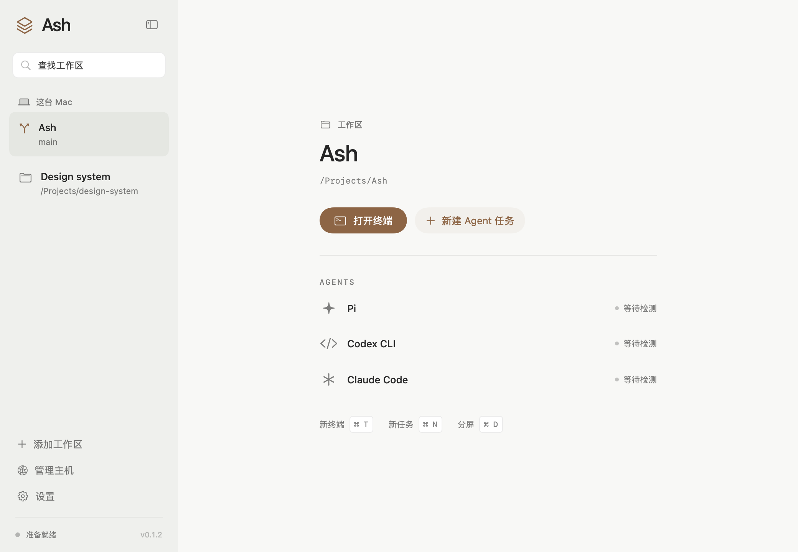

# Ash

Ash 是一个 macOS 终端应用，按项目管理本地和 SSH 会话。支持分屏标签页，也可以运行 Pi、Codex CLI 和 Claude Code。

[下载 0.1.3](https://github.com/betacatsling/ash/releases/tag/v0.1.3) · [使用指南](docs/user-guide.md) · [English](README.en.md)

[](https://github.com/betacatsling/ash/actions/workflows/ci.yml)

<picture>
  <source media="(prefers-color-scheme: dark)" srcset="docs/images/workspace-dark.png">
  
</picture>

## 安装

需要 macOS 15+、Apple Silicon 和 tmux 3.3+：

```sh
brew install tmux
```

从 [发布页](https://github.com/betacatsling/ash/releases/tag/v0.1.3) 下载 `Ash-0.1.3-macOS-arm64.zip`，解压后把 `Ash.app` 拖进“应用程序”。

目前仍是预览版，使用 ad-hoc 签名，尚未公证。首次打开若被 macOS 拦截，确认下载来源后，可在“系统设置 → 隐私与安全性”中允许打开。发布页附有 SHA-256 校验文件。

## 使用

- **⌘O** 打开项目，**⌘T** 新建终端，**⌘N** 新建 Agent 任务。
- 把两个标签拖到一起即可合并为分屏。组合页内的终端名称可以单独点击、拖动；拖到标签栏空白处就能拆出。
- 点击其他标签会切换整个页面，原来的分屏布局和比例会保留。
- 右侧面板可查看文件、Git Diff、网页和任务清单。

**⌘W 或标签上的 × 会关闭该标签页内的所有终端**，停止并归档托管会话。退出 Ash 则只断开显示，托管会话继续运行；主机重启或进程终止后无法恢复原进程。

使用 Agent 前，请在执行主机上安装并登录对应的 CLI。普通终端不需要安装 Agent。

## SSH

在“管理主机”中添加 `user@host` 或已有 SSH config 别名。Ash 沿用系统 OpenSSH 的密钥、端口和跳板机配置。

直接 SSH 无需安装远端组件；托管模式会安装应用自带的运行组件，用于持久会话和 Agent 任务。组件支持 Linux / macOS 的 arm64 和 x86_64，包含 tmux；远端不需要 Rust 或编译器。[安装与恢复说明](docs/remote-updates.md)

## 从源码运行

需要 Swift 6.2+、macOS SDK、Rust stable、Python 3、Git 和 tmux。可使用 Xcode 26+ 或相应版本的 Command Line Tools。

```sh
git clone https://github.com/betacatsling/ash.git
cd ash
cargo build --locked --manifest-path runtime/Cargo.toml
swift run Ash
```

打包 `.app` 和运行完整测试前，需要准备远端组件，步骤见[构建说明](docs/build-artifacts.md)。本次客户端 0.1.3 沿用运行组件 0.1.2。

```sh
./scripts/build.sh debug                # 开发应用
./scripts/build.sh release --no-install # 发布应用
./scripts/test.sh                       # 本地回归
./scripts/test.sh --ssh                 # 另加隔离的 SSH 测试
```

完整 Xcode 环境还可运行 `swift test`。测试不会连接已保存的远程主机或调用真实 Agent 模型。

## 文档与贡献

[使用指南](docs/user-guide.md) · [终端与标签](docs/terminal-tabs.md) · [主机管理](docs/host-management.md) · [架构](docs/architecture.md)

欢迎提交 [Issue](https://github.com/betacatsling/ash/issues) 或 Pull Request。贡献前请阅读 [CONTRIBUTING.md](CONTRIBUTING.md)，漏洞反馈见 [SECURITY.md](SECURITY.md)。

[MIT License](LICENSE)。依赖及许可证见[第三方声明](THIRD_PARTY_NOTICES.md)。
