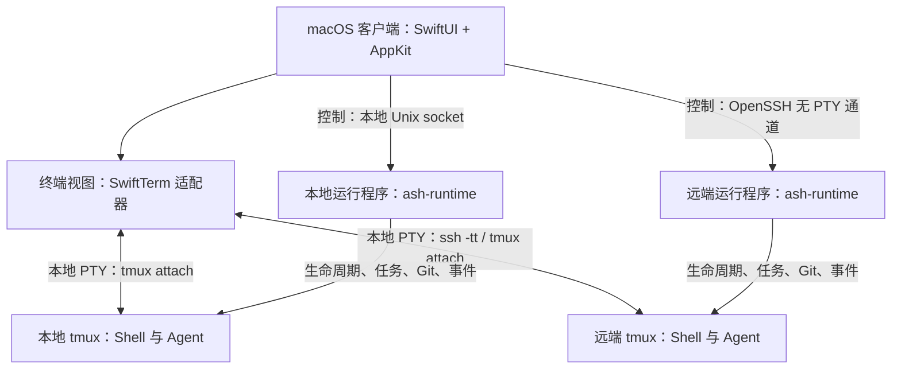

# Ash 架构提案 v0.1

日期：2026-09-05。状态：目标架构；已落地 v0.1。实际实现范围与验证结果见文末链接。

## 1. 产品边界与结论

用户已明确：macOS 原生终端；本地与 SSH 远程同等重要；工作区与 Agent 编排为一等概念；优先管理现有命令行 Agent，包括并行任务、独立 worktree、状态与结果。

建议采用 **Swift 原生客户端 + Rust 主机运行程序 + 系统 OpenSSH + 可替换的终端显示层**。运行程序在本地与远端使用相同代码和协议；首版托管会话使用 tmux 保存进程与屏幕状态。

Ash 的主要产品单位是工作区。用户在工作区内打开终端、启动 Agent 任务、查看变更与结果。窗口和分屏是工作区的展示方式，不能成为任务的生命周期所有者。

首版接入现有 Agent，不自建模型推理与工具执行循环，不做完整 IDE、跨主机目录同步或团队云服务。

## 2. 组件与进程边界

**macOS 客户端**负责窗口、侧边栏、工作区导航、分屏、终端显示、任务与变更检查、通知。终端视图处理键盘、中文输入法、选择、字体与屏幕绘制。

**ash-runtime**负责当前主机上的工作区资源、任务队列、Agent 适配器、Git worktree、托管会话、事件与结果。它是独立运行程序，生命周期不能绑定到 GUI 或某条 SSH 连接。Rust 是本提案的工程选择：便于在 macOS 与 Linux 共用进程、文件和协议实现；不意味着原生界面也使用 Rust。

**tmux**负责托管 Shell / Agent 的实际伪终端、后台运行和重新附着时的屏幕重绘。Ash 自己管理可见分屏，不把整个 tmux 布局直接作为产品界面。首版每个 Ash 托管会话对应一个独立的单窗口、单面板 tmux session，使用 Ash 专属 socket 和配置，避免修改用户已有会话。

**OpenSSH**负责连接、认证、跳板、连接复用和隧道。Ash 负责配置入口、连接状态和恢复流程。终端字节流走交互通道；任务与文件元数据走独立控制通道，二者不能混在一起。

## 3. 技术选择

| 层 | 建议 | 取舍 |
| --- | --- | --- |
| 原生应用 | Swift + SwiftUI，必要处使用 AppKit | SwiftUI 管理界面状态；AppKit 承接终端输入与复杂窗口交互 |
| 终端显示首版 | SwiftTerm 的 TerminalView | 已提供 macOS NSView 与自定义输入输出接入点；先完成产品闭环 |
| 备选终端内核 | Ghostty 嵌入方案 | 先验证完整渲染和外部会话接入；不能把 libghostty-vt 当作完整 Metal 终端控件 |
| 运行程序 | Rust，共用核心，平台差异集中到少量模块 | 同时覆盖本地 macOS 与远端 Linux；增加一套工具链但避免实现两套编排逻辑 |
| 托管会话 | tmux | 复用后台运行与重连能力；代价是依赖及终端特性兼容性需要实测 |
| SSH | 目标 Mac 上的系统 OpenSSH | 尽量兼容用户已有配置，不在首版重写 SSH 协议栈 |
| 存储 | SQLite + 有限保留的日志文件 | 元数据和事件事务写入；高频终端输出不逐字写数据库 |
| 发布方向 | 签名、公证的独立 macOS 应用 | 首版按完整终端和后台运行需求设计，App Store 分发另行评估 |

SwiftTerm 官方仓库明确提供可嵌入的 macOS AppKit 视图和可接入任意数据源的接口。[官方仓库](https://github.com/migueldeicaza/SwiftTerm)

Ghostty 当前文档说明 libghostty-vt 已可使用，但 API 签名仍在变化，且尚未打 libghostty 版本标签。因此，先固定适配边界，不承诺终端内核可以无成本替换。[官方说明](https://github.com/ghostty-org/ghostty/blob/main/README.md)

SwiftUI 可以通过 NSViewRepresentable 承载 AppKit 视图。[Apple 文档](https://developer.apple.com/documentation/swiftui/nsviewrepresentable)

首版平台建议为 macOS 15+，远端先支持 Linux 的 arm64 / x86_64。它们是待验证的产品支持范围，不是上述库统一要求的最低版本。

## 4. 核心领域模型

| 对象 | 含义与约束 |
| --- | --- |
| Host | 本机或一台远端执行主机，包含身份、连接设置和能力信息 |
| Project | 一个逻辑项目，可登记多个主机上的仓库位置；不隐含目录同步 |
| Workspace | 一个具体工作上下文，绑定一个 Host 和该主机上的目录；可为现有 checkout、独立 worktree 或普通目录 |
| Session | Shell、Agent 或命令的运行会话；使用稳定 ID，独立于窗口存在 |
| Pane | 可见终端面板，附着到 Session；移动、隐藏面板不改变任务归属 |
| Task | 用户意图、输入、工作区和结果的长期记录 |
| Run | Task 的一次执行尝试；重试创建新 Run，保留之前的记录 |
| AgentProfile | 命令入口、参数、环境策略、适配器类型与能力声明 |
| Artifact | 本次 Run 产生的总结、文件变更、补丁、日志及退出信息 |

关系：Project 拥有多个 Workspace；每个 Workspace 绑定一个 Host；Task 的每次 Run 明确指定 Workspace、AgentProfile 和 Session；Pane 仅引用 Session。

本地与远端共享同一套操作语义，例如 createWorkspace、startRun、attachSession、cancelRun、getChanges。路径必须与 Host ID 一起使用，远端路径不能传给本地文件 API。

## 5. SSH 与远程模式

提供两种明确的能力级别：

1. **直接 SSH**：无需安装 Ash 远端程序。提供交互终端、主机配置与隧道；不承诺后台任务保活、结构化 Agent 状态或完整远程编排。
2. **托管主机**：部署 ash-runtime，并具备经过验证的 tmux。获得与本地相同的工作区、任务、worktree、状态和结果功能。辅助程序以普通用户身份运行，不开放额外公网端口。

本地同样使用托管模式实现完整编排。普通本地 Shell 可以走直接 PTY；不能让用户误以为这种会话也具备托管恢复保证。

读取已有 SSH 配置，用户指定别名后由系统 ssh 解析最终配置，可使用 ssh -G 获取生效值。UI 的主机发现只是便利功能，不试图完整复刻 Host / Match / Include 语义。显式标识连接和本地配置评估，因为 Match exec 等设置本身可能执行命令。

支持已有密钥、ssh-agent、known_hosts、ProxyJump；按照目标 Mac 的 OpenSSH 实际能力测试。使用独立 ControlPath 管理 Ash 自有复用连接，避免干扰外部客户端。密码、MFA 与首次主机指纹确认必须进入明确的认证流程。[OpenSSH 配置文档](https://man.openbsd.org/ssh_config)、[ssh 命令文档](https://man.openbsd.org/ssh)

ControlPersist 只管理连接复用生命周期；SSH 连接失效后不能靠它恢复原 Shell。托管模式通过重新连接并附着 tmux 会话恢复交互。[tmux 官方说明](https://github.com/tmux/tmux/wiki/Getting-Started)

运行程序部署流程包括平台探测、版本校验、校验和验证和原子更新。具体的发布物信任与升级流程在实现前设计；当前阶段不部署远端程序。SSH 无 PTY 控制通道运行 ash-runtime 的连接桥，桥接进程退出不应终止后台运行程序。

本地后台服务通过 macOS 的服务管理机制集成；远端优先使用受支持的用户级服务管理。缺少后台生命周期支持时明确报告能力不足，不宣称依靠普通 SSH 子进程获得后台常驻。[Apple SMAppService](https://developer.apple.com/documentation/servicemanagement/smappservice)

## 6. Agent 编排

首版提供手动并行启动、每主机并发限制、排队、取消、重试、状态与结果收集。任务依赖图、定时任务、自动选择 Agent 和跨主机迁移后续再做。

AgentAdapter 声明并实现：

- 可执行程序与版本探测；构造命令和启动环境。
- 是否支持交互终端、结构化事件、等待用户输入、恢复对话。
- 启动、收集事件、取消、退出与结果归档。
- Provider 会话 ID 和 Run ID 的映射；只有 Provider 明确支持时才开放恢复对话。

通用 CLI 适配器只保证启动、终端、进程存活、退出码和文件变更。具体 Agent 的结构化协议或官方 hook 经逐个核实后再接入；不把解析终端提示符或 ANSI 画面当作可靠状态协议。

状态分为三条独立轴：

- **执行状态**：queued、starting、running、exited、failedToStart、cancelled、lost。
- **Agent 活动状态**：working、waitingForUser、idle、unknown，仅在有可靠信号时展示。
- **连接状态**：connected、reconnecting、offline。

断网只改变连接状态，本地显示最后已知执行状态及更新时间。进程退出码 0 表示命令正常退出，不能直接宣称用户任务已完成。任务结果另有待检查、接受和继续处理的状态。

取消必须等待主机确认并处理本次 Run 的进程组，不能用杀掉 SSH 客户端代替取消。离线时只能记录待发送的取消请求，重连后显示真实结果。

需要修改同一仓库的并行任务默认各自分配 worktree；非 Git 目录支持普通终端，但不伪造 worktree 隔离。worktree 在执行主机上创建，并记录基准 commit、分支和实际目录。[Git 官方文档](https://git-scm.com/docs/git-worktree)

创建与删除涉及共享 Git 元数据时串行化。默认不复制原 checkout 的未提交改动；用户选择包含改动时另做快照迁移。worktree 不隔离端口、数据库、依赖缓存和外部服务。setup 脚本需要工作区信任策略；清理之前检查未提交和未归档产物，不能顺手删除用户工作。

## 7. 协议、数据与恢复

**控制通道**：带长度帧的版本化 JSON 消息。本地通过 Unix socket；远端通过 OpenSSH 无 PTY 通道。消息具备协议版本、request ID、Host / Workspace / Run ID。握手返回能力集，不能只凭版本号假设所有主机能力相同。

**终端通道**：原始终端字节、键盘输入和尺寸变化，通过本地 PTY 中的 tmux 客户端或 ssh 客户端传输。不要把终端每次输出都变成 SwiftUI 状态更新；输出处理和界面刷新应有界缓冲与批处理。

**状态所有权**：每个 ash-runtime 的 SQLite 是该主机 Run、资源和事件的权威记录；客户端数据库保存主机目录、跨主机项目关联、布局、偏好及远端缓存。两者不对同一个 Run 同时拥有最终写权限。

事件包含 Run ID、主机实例标识和单调递增序号，允许从游标补取、去重。游标过期则取当前快照，历史缺口明确显示。重连先列举实际会话并对账，再恢复显示和调度。

启动请求使用幂等键；会话名由稳定 Run ID 派生。数据库事务不能覆盖进程创建，因此必须保留 starting 状态，并在重启时检查 tmux 会话与运行记录，处理“进程已启动但回复丢失”的窗口，避免自动重复执行。

| 故障或动作 | 托管模式预期行为 |
| --- | --- |
| 切换工作区、关闭 Pane 或窗口 | 会话继续，之后可重新附着 |
| GUI 崩溃 | 运行程序与 tmux 继续；重启客户端恢复布局并对账 |
| SSH 断线、Mac 睡眠 | 远端已启动任务继续；本地睡眠期间的执行不保证推进 |
| Mac 离线 | 远端运行程序继续处理已提交到该主机的队列；不承诺跨主机协作继续 |
| ash-runtime 崩溃 | tmux 内进程可继续；监督程序恢复后对账，编排在恢复前暂停 |
| tmux 或执行主机退出、重启 | 活进程与内存会话不能保证恢复；保留记录并标识中断，重试创建新 Run |
| SSH 断线时申请取消 | 显示待取消，不能提前标为已取消 |

恢复屏幕交给 tmux 重新附着和重绘；这不等于完整恢复 GUI 的历史 scrollback、选择或所有图形协议状态。日志和结果独立归档，设定保留与大小上限，不用一段截断 ANSI 日志宣称精确恢复终端。

## 8. 原生界面结构

推荐工作区优先的三栏布局：左侧 Project / Workspace 导航；中间终端分屏和标签；右侧可收起的任务详情、变更与结果检查。主机位置始终可见，等待输入的任务有明确标记，颜色之外同时使用图标和文字。

可以保留三种产品方向供后续视觉设计比较：

| 方向 | 组织方式 | 适用性 |
| --- | --- | --- |
| 工作区优先，推荐 | 类 Xcode 的导航、工作区画布和 Inspector | 终端、Agent、Git 能围绕同一上下文组织 |
| 终端优先 | 极简窗口，工作区与任务作为抽屉 | 日常 Shell 最轻，但多任务管理需要额外导航 |
| 任务优先 | 队列和结果为主，终端作为任务详情 | 适合大批量 Agent 工作，普通终端操作不够直接 |

采用系统字体、SF Symbols、原生菜单和快捷键，支持明暗模式与减少动态效果。终端区域保证稳定对比度。输入法、焦点、快捷键与辅助功能必须和视觉一起验证。初步设计约定见 brand-spec.md；它是草案，不表示用户已选定视觉风格。

## 9. 实施顺序与验收门槛

### 阶段 0：验证最有可能推翻架构的链路

用最小原生窗口接入 SwiftTerm，走本地 tmux 和远端 ssh + tmux；验证中文输入、组合字符、颜色、鼠标、缩放、复制粘贴、全屏 TUI 和至少一种目标 CLI Agent。测试持续大量输出与多个可见/隐藏会话，测量输入延迟、内存与主线程卡顿，之后确定性能预算。

同时验证 GUI 退出、SSH 断线、运行程序重启后的附着与对账。若 SwiftTerm 或 tmux 阻碍核心交互，在这个阶段评估 Ghostty 及会话后端调整；不在大规模 UI 开发后更换。

### 阶段 1：终端与工作区闭环

本地和远端走同一套 Host / Workspace / Session 接口；实现主机连接、托管会话、分屏、布局持久化与恢复。直接 SSH 提供基础兼容模式。

### 阶段 2：单类 Agent 完整闭环

实现 Task / Run、独立 worktree、并发队列、取消与重试、可靠状态、变更和结果检查。先把一种有明确接口的 Agent 做透，再扩展适配器。

### 阶段 3：发布与扩展

补齐安装升级、协议兼容、服务生命周期、日志保留与应用签名发布；增加第二类 Agent，验证领域模型没有绑定单一供应商。任务依赖、端口管理和更丰富自动化在闭环稳定后加入。

必须覆盖的语义测试：相同启动请求不产生两个 Run；失联不被标为失败；远端取消确认之前不显示已取消；清理不丢未归档修改；旧版本运行程序能被识别；退出码不能代替任务结果判断。

## 10. 尚待用户确认的产品假设

- 完整远程编排允许部署普通用户权限的 ash-runtime 与 tmux；不能安装的主机只提供直接 SSH 能力。
- 远端首版以 Linux 为主，本地最低系统暂定 macOS 15。
- 第一版优先工作区与编排闭环；终端内核最终采用性能与兼容性验证结果，而不提前承诺 Ghostty。

以上不阻止确定领域模型和组件边界，但会影响首版依赖、支持矩阵和工作量。

## v0.1 实现落地

第一版已经在此仓库实现。上文是目标架构；当前版本采用 tmux 内的独立 worker 和单请求 JSON 控制协议，具体能力与分期差异以 [v0.1 实现说明](v0.1-implementation.md) 为准。构建和使用入口见 [README](../README.md)。
