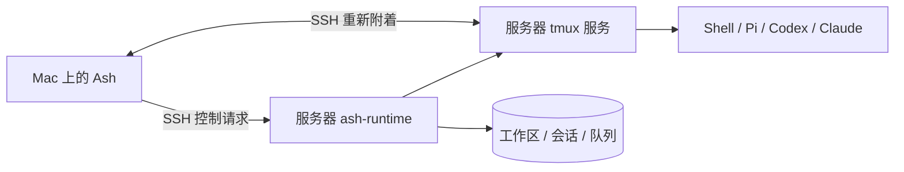

# Ash 0.1.1：托管 SSH 与工作区恢复

日期：2026-09-05。

## 用户可见的变化

- 顶部工作区标题使用原生窗口标题与副标题，修复标题被工具栏胶囊裁切、重复显示 Ash 的问题。
- 新增 SSH 主机默认启用托管模式；直接 SSH 的说明明确标出它不提供会话恢复。
- 退出 Ash 只断开显示，服务器上的 Shell 和 Agent 继续运行。重开后恢复工作区与原会话；断线后自动重新附着。
- 工作区名称、目录、分支、分屏状态、主副终端编号和隐藏状态会同步到执行主机。即使本机工作区清单丢失，只要保留主机配置与可用的 SSH 认证，仍可找回服务器上的工作区。
- 离线时显示最近的工作区和会话缓存，保留最后已知执行状态。

## 运行方式

服务器端使用 `ash-runtime + tmux`。tmux 服务持有终端和实际进程；ash-runtime 的 SQLite 保存会话、工作区和队列，调度器在独立的 tmux 会话中运行。连接用的短期请求进程退出，不会结束实际任务。

没有新建公网监听端口，沿用系统 OpenSSH 的配置、认证及跳板设置。

## 恢复顺序与同步规则

1. 启动时先加载本地布局与最近会话缓存。
2. 对每台托管主机查询能力和当前会话。服务器对账实际 tmux 会话，返回会话及工作区清单。
3. 导入本地缺失的工作区，恢复服务器保存的分屏和会话关联；已有的本机布局与离线修改优先保留。
4. 将本地新建或修改的工作区同步到服务器。请求期间继续发生的修改不会被旧回复覆盖；同步失败保留待同步状态并显示原因。
5. 可见终端通过原来的 Run ID 附着原 tmux session。已断开的视图在确认远端仍运行后自动重建连接，重试间隔逐渐增加到 30 秒；稳定连接后重置。

恢复路径不会调用启动任务接口，不会再次执行原命令。进程当前目录、环境变量和内存状态之所以保留，是因为原进程仍在服务器运行。

协议保持版本 1，以 `workspace-registry` 能力标志协商新增功能。旧运行程序仍可按会话恢复工作区分组；完整名称和布局备份需要升级运行程序。现有数据库自动增加工作区表，旧会话在首次读取时补建分组。

## 如何启用

在“管理主机”中添加 SSH 别名或地址，先通过“认证 / 终端”完成必要认证，然后从主机菜单执行“安装 / 更新运行程序”。远端需要 tmux 3.3+、Rust/Cargo、C 工具链；Agent 需要在远端安装和登录。开启托管模式，在该主机的工作区中新建终端。

已有直接 SSH 会话不会被静默迁移；需要新建托管终端。旧版远端程序应通过上述入口更新。

## 保证的边界

- 关闭客户端、网络中断或本地睡眠不终止仍存活的远端托管任务。
- 服务器重启、tmux 服务被终止或实际进程退出，不能恢复原进程内存；记录保留，会话标记中断或退出。
- 密码、MFA 或密钥过期时仍需要完成认证，自动重连不能绕过认证。
- 本地缓存不是服务器备份；丢失主机配置时，需重新添加同一主机后才能查询其工作区。
- 多台客户端各自保留已有布局；服务器保存最近同步的恢复副本，不提供多人实时布局合并。
- 本次使用隔离的真实 loopback SSH 服务验证，尚未在用户的实际服务器或独立 Linux 机器部署验收。

## 验证

`./scripts/test.sh --ssh` 包含真实 tmux 与 OpenSSH 测试。恢复检查使用实际 AppStore、JSON 持久化和 RuntimeClient，仅替换终端视图用于观察重连动作；交互 SSH 附着另用真实客户端验证。

已验证：服务器元数据持久化、旧会话分组迁移、本地清单为空时恢复、双终端布局、离线缓存、断线自动重新附着、恢复前后相同的 Shell PID 和环境变量，以及没有新增 Run。原生窗口标题另在隔离运行的打包应用中目视检查。
